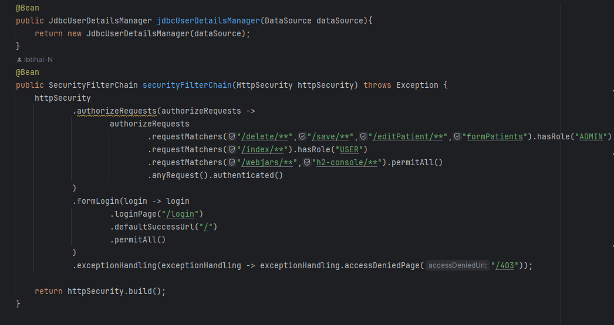

<h2>Activité Pratique 3</h2>
<h4>Partie 1</h4> 

Créer une application Web JEE basée sur Spring MVC, Thylemeaf et Spring Data JPA qui permet de gérer les patients. L'application doit permettre les fonctionnalités suivantes :

Afficher les patients

Chercher les patients

Supprimer un patient

Faire des améliorations supplémentaires

<h4>Partie 2</h4>  

Créer une page template

Faire la validation des formulaires

<h4>Partie 3 :Sécurité avec Spring security </h4>

